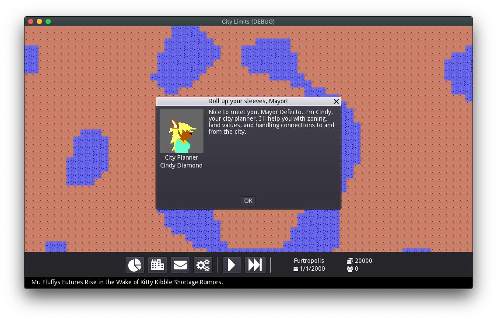

# City Limits

City Limits is a re-imagining of SimCity Classic that brings modern city building concepts to the classic game.

## Getting Started

### Prerequisites

- Godot Engine 3.x

## Authors

- **Tony Bark** - _Initial work_ - [tonytins](https://github.com/tonytins)
- **Maxis** - _Assets_ - [SimHacker](https://github.com/SimHacker/)
- **Font Awesome** - *Icons* - [FortAwesome](https://github.com/FortAwesome)

See also the list of [contributors](https://github.com/tonytins/citylimits/contributors) who participated in this project.

## License

This project is licensed under the Artistic-2.0 License - see the [LICENSE](LICENSE) file for details
